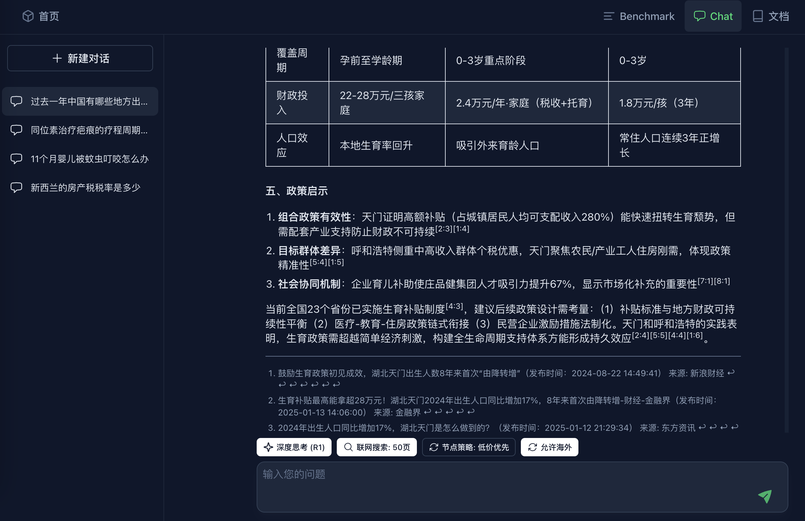

# YYDS Seek Chat

一个轻量级Vue 3的LLM Chat组件。 来自[yydsseek.com](https://yydsseek.com/chat)

## 预览



## 特性

- `LLM 聊天`
- `Markdown`： 支持代码高亮、表格、Latex数学公示、Footnote脚注引用
- `暗黑模式`切换： 通过 useColorMode
- `聊天记录`本地存储：通过IndexDB
- `深度思考`(Deepseek R1)。仅适用YYDSSeek API。
- `网页搜索`: 支持简单搜索和复杂搜索。仅适用YYDSSeek API。
- `节点策略(Router)`: 仅适用YYDSSeek API。


## 依赖

- 见`package.json`,主要是`Nuxt/ui`,`tailwindcss`,`markdown-it`等等


## Demo 使用

1. Clone the repository
2. Install dependencies:
```bash
npm install
```

3. Configure environment variables:
   - Copy `.env.example` to `.env`
   - Update the values in `.env`:
     - `VITE_API_KEY`: Your API key，建议使用YYDSSeek API.
     - `VITE_API_BASE_URL`: API base URL
     - `VITE_API_MODEL`: API model name

4. Run the development server:
```bash
npm run dev
```
